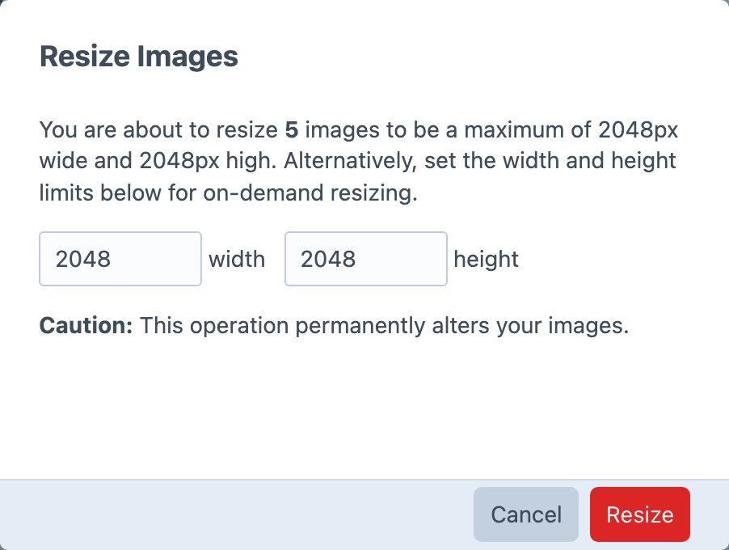
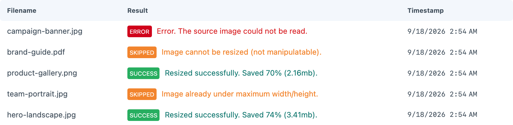

<!-- feature-intro -->
Keep oversized uploads from taking more disk space than they need. Image Resizer can automatically bring large source images down to sensible dimensions, process existing assets in batches and retain the originals when required.
<!-- feature-intro-end -->

<!-- feature-section media-size="medium" -->
## Resizing

Resize automatically during upload or on demand from Craft’s Assets index. Set a maximum width and height, keep an original when the project needs a recoverable copy, and avoid replacing a source when the resized result would be larger.

<!-- feature-section-end -->

<!-- feature-section media-size="medium" -->
## Resize logging

Each resize creates a log entry so you can see what happened, investigate a problem with a particular image and understand how much space the operation saved. For an existing volume, select assets from their index and process them in a batch.

<!-- feature-section-end -->
